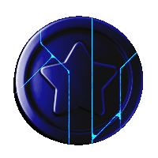

# 🟦 🟦 Cube X Crash

  

**Cube X Crash** is a Java game I developed as my final project for ICS4U.

## Technical
This game was built using Java and Swing _(yes, Swing—not exactly the go-to for modern game development, but hey, sometimes you work with what you must)_, relying solely on Java's built-in libraries. The game uses a custom abstract class called `GameObject` to manage all in-game objects. It features a `ScreenManager` class that handles the game loop and all screen transitions. Game data is stored in a `.properties` file, which the game reads.

## Basic Instructions

- Launch a stack of balls to break blocks.
- After each launch, blocks move downward.
- As the game progresses, blocks require more damage to break, increasing the challenge.

## Block Types

| Image                                                                                     | Block Type       | Description                                              |
|-------------------------------------------------------------------------------------------|------------------|----------------------------------------------------------|
|    | **Normal Block** | A standard block that requires damage to be destroyed.   |
|    | **Half Block**   | A triangular block that requires damage to be destroyed. |
|  | **Temp Ball**    | Grants an additional ball for this round only.           |
|            | **Coin**         | Can be collected and used to purchase power-ups.         |

## Power-ups

| Image                                                                                                 | Power-up                 | Description                                                   |
|-------------------------------------------------------------------------------------------------------|--------------------------|---------------------------------------------------------------|
|  | **Extra Permanent Ball** | Grants an additional ball permanently.                        |
|    | **Break Bottom Row**     | Clears all blocks in the lowest occupied row.                 |
|                | **Clear Grid**           | Removes all blocks and repopulates the top row with new ones. |

---

**Note:** This game has only been tested on the device it was developed on. Apologies for any unforeseen compatibility issues. 😃
